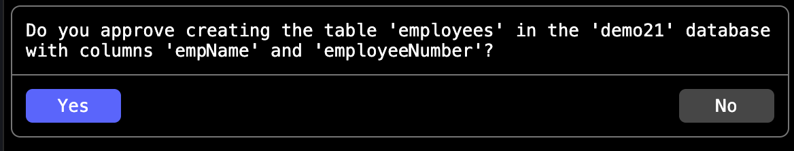

# Human In Loop (HIL) agentic flow.

Some of agent workflows needed human intervention at a particular stage. Agent workflow will waitfor the response, and proceed. There are two types of HIL

1. The workflow will pause and wait for the response from user.
2. Workflow will finish. When user approves a new workflow will be triggered.

In this example we will run usecase (1). For (2) check the **approvals** example.

## HIL with Webhook

In this example, we will trigger an asynchronous workflow that pauses for user input. The workflow uses a Webhook trigger to send a notification when a human response is required. Once the webhook is fired, the flow is placed on hold rather than waiting for an immediate response. The client will later call a separate API to submit the user's input and resume the workflow.


This example will use SQLLite MCP server. Agent is simple. We will just create a table and expect the agent to get human in loop approval. See the last line in sqliteContext.txt

1. Ensure you build SQLite MCP server, FlowStack Server and FlowStack UI
2. See the configuration in agents.json. We need a webhook. For this purpose, we will use a simple python script, listening on port 8090. All it does is dump the request it received. Check the `dump.py` in this folder. We need to run it.

    ```
    python3 ./dump.py
    ```
3. Start FlowStack server. Run the following command from your `flowstack` repository root folder. Replace `mcp_server_folder` witho your MCP server repo root folder.

    ```
   java -Dfs.mcpConfigFile=./examples/human_in_loop/mcpServers.json \
        -Dfs.agentsConfigFile=./examples/human_in_loop/agents.json \
        -Dfs.channelsConfigFile=./examples/human_in_loop/channelsConfig.json \
        -Dmcp.base=<mcp_server_folder> \
        -DopenAI.model.logRequests=true \
        -jar build/libs/flow_stack-0.0.1.jar
    ```
4. Start the FlowStack UI
    ```
    npm run dev
    ```

5. In the web CLI, enter the following prompt
    ```
    agent run sqlite --log --archive   Create a table in sqlite database with name employees. Use empName and employeeNumber as columns. Use demo20 as the database.
    ```

    This will start the flow and in few seconds call the webhook URL. The process, you started in step (2). Note down the session Id
6. To simulate the approval, we will call the REST API exposed by the server for approval flow. (We cannot use REST channel here as it does not support two way communication). Run the folowing `curl` command. Replace the session Id, with the sessionId you received from previois step.

    ```
    curl -X POST "http://localhost:8080/fs/api/v1/sessions/<sessionId>/approve" \
        -H "Content-Type: application/json" \
        -d '{
            "response": "Approved",
            "status": "success"
        }'
    ```
    You will get a confirmation on the web CLI that the table has been created. You can check the SQLite DB using any appropriate tool.

7. Let us run a case where the request is not approved. Delete the DB file. and run the prompt mentioned in step (5) again.
8. In next step, instead of sending approval, let us reject. Run the following curl command. Replace the session Id as appropriate.

    ```
    curl -X POST "http://localhost:8080/fs/api/v1/sessions/<sessionId>/approve" \
        -H "Content-Type: application/json" \
        -d '{
            "response": "Not approved",
            "status": "rejected"
        }'
    ```

    The flow will be terminate and the table will not be created.

## HIL with event channel
This usecase will be similar follow. Instead of webhook we will use **event** mode. Here, the agent will use the channel which triggered the event/prompt for approval. Make sure you stopped the server before, following the steps below as you will be modifying the cofiguration. You can also terminate the python HTTP dump tool, as we are not using webhook now.

1. Update the agents.json, remove the `webhook` target type for `hitlConfig`. Use `event` type instead. Also, remove the `instance` attribute. So, your hitlConfig should look like below.
    ```
    "hitlConfig" :{
        "targets" : [
            {
                "type" : "event"
            }
        ]
    }
    ```

2. Start the FlowStack server

    ```
   java -Dfs.mcpConfigFile=./examples/human_in_loop/mcpServers.json \
        -Dfs.agentsConfigFile=./examples/human_in_loop/agents.json \
        -Dfs.channelsConfigFile=./examples/human_in_loop/channelsConfig.json \
        -Dmcp.base=<mcp_server_folder> \
        -DopenAI.model.logRequests=true \
        -jar build/libs/flow_stack-0.0.1.jar
    ```

3. In the web CLI, enter the following prompt. 
    ```
    agent run sqlite --log --archive   Create a table in sqlite database with name employees. Use empName and employeeNumber as columns. Use demo21 as the database.
    ```
4. This time instead of webhook, you will see a confirmation in the web CLI which looks like the one below.


5. Click **Yes** to proceed.
