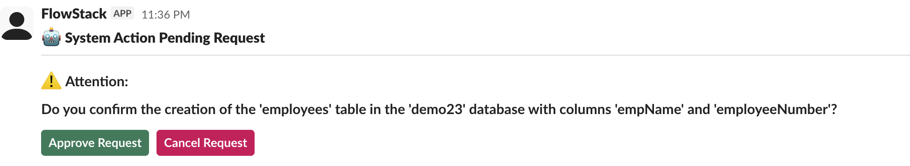

# Slack channel

In this example we will cover two usecases

1. Integration of agent with an external channel (Slack)
2. Human in loop for channel

## Steps
1. Ensure you build SQLite MCP server, Slack Channel, FlowStack Server.
2. Ensure that slack channel configuration is done. Follow the [instructions](https://vittoda.github.io/flowstack/configurations/). Ensure that *FlowStack* app is added to the channel.
3. Start the followstack server. Replace the `mcp_server_folder` with the correct root folder for MCP server repository.
    ```
       java -Dfs.mcpConfigFile=./examples/slack_channel/mcpServers.json \
        -Dfs.agentsConfigFile=./examples/slack_channel/agents.json \
        -Dfs.channelsConfigFile=./examples/slack_channel/channelsConfig.json \
        -Dmcp.base=<mcp_server_folder> \
        -DopenAI.model.logRequests=true \
        -jar build/libs/flow_stack-0.0.1.jar
    ```
4. Now we will enter the prompt through Slack. In the channel, where FlowStack app was added, enter the following text
    ```
    agent run sqlite --log --archive  Create a table in sqlite database with name employees. Use empName and employeeNumber as columns. Use demo23 as the database.
    ```
5. This will trigger the workflow and send the confirmation in the same channel, 


6. Approve the request. The workflow will continue and table will be created.